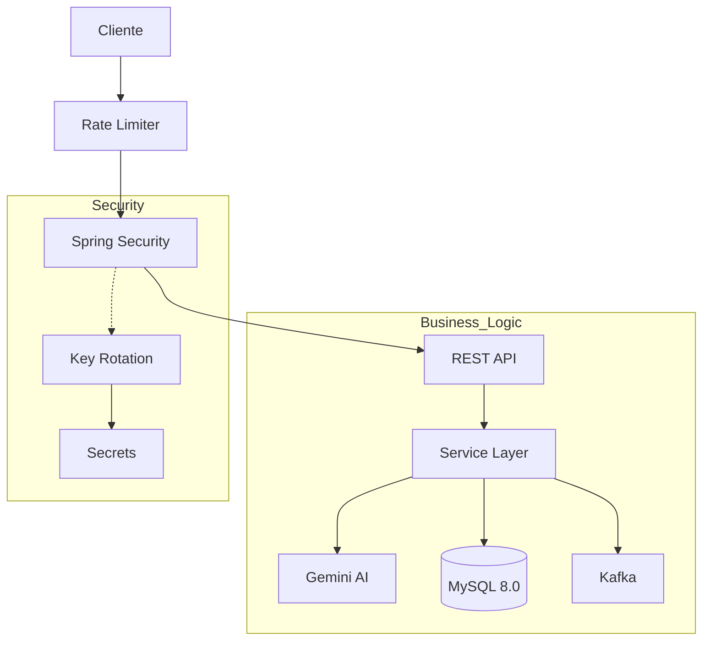

# SentinelRisk: AI-Powered Financial Risk Assessment Platform

[](https://www.oracle.com/java/)
[](https://spring.io/projects/spring-boot)
[](https://www.docker.com/)
[](https://www.mysql.com/)
[](https://kafka.apache.org/)

> Sistema backend de alto rendimiento para análisis de riesgos financieros, potenciado por IA generativa y diseñado bajo una arquitectura de Defensa en Profundidad.

---

## Arquitectura del Sistema

El sistema sigue una arquitectura por capas estricta, desplegada mediante contenedores Docker orquestados.



---

## Características Clave (Security First)

Este proyecto implementa una estrategia de Defense in Depth (Defensa en Profundidad).

### 1. Rate Limiting (Protección Anti-DDoS)

Implementación del algoritmo Token Bucket mediante Bucket4j.

- Función: Protege la API contra ataques de fuerza bruta y saturación.
- Política: 10 peticiones por minuto por cliente.
- Respuesta automática: `429 Too Many Requests`.

---

### 2. Rotación de Claves JWT (Zero-Downtime)

SentinelRisk implementa rotación automática de secretos en lugar de usar una clave estática.

- Algoritmo: HS256.
- Rotación cada 24 horas.
- Ventana de transición sin desconexión de usuarios activos.

---

### 3. Auditoría Forense (Event-Driven)

Sistema de logs inmutables basado en eventos asíncronos.

- Registra intentos de login fallidos.
- Registra accesos no autorizados.
- Registra operaciones críticas.
- Permite trazabilidad completa ante incidentes.

---

### 4. Hardening de Cabeceras HTTP

Aplicación de cabeceras OWASP recomendadas:

- `X-Frame-Options: DENY`
- `X-Content-Type-Options: NOSNIFF`
- `Strict-Transport-Security (HSTS)`

---

## Stack Tecnológico

| Capa | Tecnología | Descripción |
|------|------------|------------|
| Lenguaje | Java 17 (LTS) | Records y Pattern Matching |
| Framework | Spring Boot 3.2 | Core del sistema |
| Seguridad | Spring Security 6 | JWT dinámico y Stateless |
| IA | Google Gemini Pro | Análisis financiero |
| Base de Datos | MySQL 8 + JPA | Persistencia transaccional |
| Mensajería | Apache Kafka | Eventos críticos |
| Infraestructura | Docker Compose | Orquestación de contenedores |

---

## Instalación y Despliegue

Todo el entorno está completamente dockerizado.

### Prerrequisitos

- Docker Desktop instalado y en ejecución.

---

### 1. Clonar el repositorio

```bash
git clone https://github.com/TU_USUARIO/SentinelRisk.git
cd SentinelRisk
```

---

### 2. Configurar secretos

Crear un archivo `.env` en la raíz del proyecto:

```
GEMINI_API_KEY=tu_clave_de_google_aqui
```

---

### 3. Compilar el proyecto

En Windows (PowerShell):

```powershell
./mvnw clean package "-Dmaven.test.skip=true"
```

---

### 4. Levantar contenedores

```bash
docker-compose up --build
```

---

### 5. Verificación

Esperar el log:

```
Started SentinelriskApplication
```

Acceder a la documentación:

```
http://localhost:8080/swagger-ui.html
```

---

## Documentación de API

### Autenticación

- `POST /api/auth/register`
- `POST /api/auth/login`

---

### Análisis de Riesgo

- `POST /api/risk/analyze` (Requiere Bearer Token)

**Input:** JSON con ingresos, deudas e historial.  
**Output:** Análisis IA + Nivel de Riesgo (BAJO / MEDIO / ALTO).

Si el riesgo es ALTO, se dispara un evento asíncrono a Kafka.

---

## Roadmap

- [ ] Dashboard con Grafana y Prometheus.
- [ ] Servicio de notificaciones (Email/SMS).
- [ ] Tests de carga con JMeter.
- [ ] Métricas avanzadas con Micrometer.

---

## Autor

Desarrollado por Eugenio Garcia Calvo.
