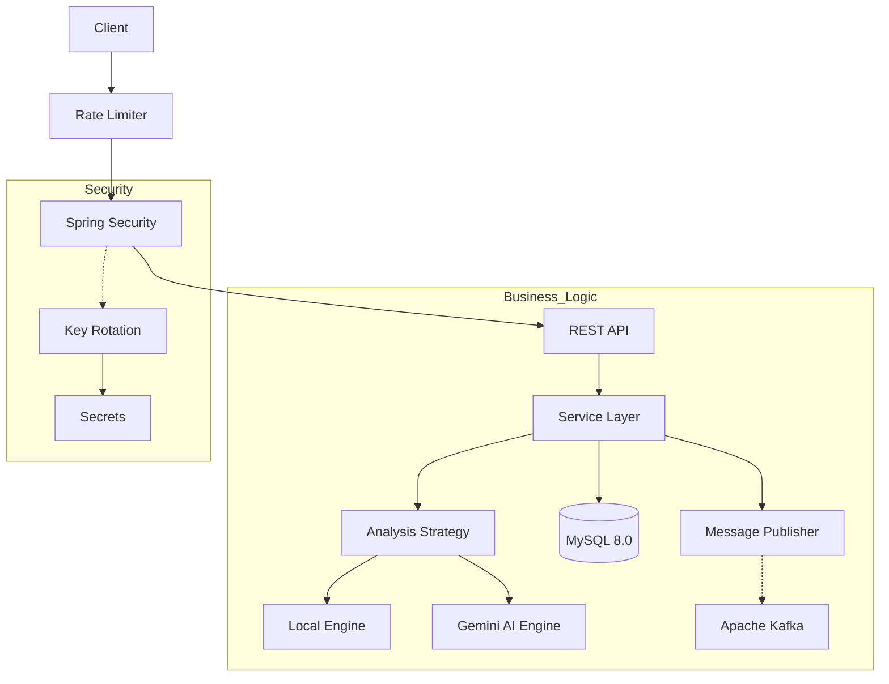

# SentinelRisk: AI-Powered Financial Risk Assessment Platform

[](https://www.oracle.com/java/)
[](https://spring.io/projects/spring-boot)
[](https://www.docker.com/)
[](https://www.mysql.com/)
[](https://kafka.apache.org/)
[](https://junit.org/junit5/)
[](https://checkstyle.sourceforge.io/)

> High-performance backend system for financial risk analysis, powered by Generative AI (Google Gemini) and designed under a strict Defense in Depth architecture.

---

## What's New (Latest Architecture Updates)

The system has undergone a major architectural refactoring to meet Senior-level engineering standards:

* **Domain-Driven Design (DDD):** Transitioned from a layered architecture to a Package-by-Feature structure (`domain.risk`, `domain.auth`, `domain.user`, `infrastructure`) for high cohesion and low coupling.
* **Strategy Design Pattern:** Implemented a hybrid analysis engine. The system evaluates risks using a highly optimized **Local Logic Strategy** (keyword-based fast-track) and falls back to an **AI Strategy** (Google Gemini) for deep contextual analysis.
* **Interface-Driven Messaging:** Kafka producers are now decoupled behind a `MessagePublisher` interface, making the system infrastructure-agnostic.
* **Advanced Swagger UI:** Integrated **OAuth2 Password Flow** directly into OpenAPI. You can now log in and attach JWT tokens automatically within the Swagger UI. Added Enum support for interactive dropdowns in API requests.
* **Structured Error Handling:** Implemented a `@RestControllerAdvice` Global Exception Handler. All errors (404, 400, 500) now return a standardized JSON format instead of default white-label pages.
* **Code Quality & Testing:** Integrated **Checkstyle** for static code analysis and a comprehensive test suite using **JUnit 5 and Mockito** (fully compatible with Java 21 via Byte Buddy).

---

## System Architecture

The system follows a strict layered and domain-driven architecture, deployed via orchestrated Docker containers.



---

## Key Features (Security First)

This project implements a Defense in Depth strategy.

### 1. Rate Limiting (Anti-DDoS Protection)

Implementation of the Token Bucket algorithm using Bucket4j.

* **Function:** Protects the API against brute-force and saturation attacks.
* **Policy:** 10 requests per minute per client.
* **Automatic Response:** `429 Too Many Requests`.

### 2. JWT Key Rotation (Zero-Downtime)

SentinelRisk implements automatic secret rotation instead of using a static key.

* **Algorithm:** HS256.
* **Rotation:** Every 24 hours.
* **Seamless Transition:** Active users are not disconnected during the rotation window.

### 3. Forensic Auditing (Event-Driven)

Immutable log system based on asynchronous events.

* Logs failed login attempts.
* Logs unauthorized access.
* Allows full traceability in the event of security incidents.

### 4. HTTP Headers Hardening

Application of OWASP recommended headers:

* `X-Frame-Options: DENY`
* `X-Content-Type-Options: NOSNIFF`
* `Strict-Transport-Security (HSTS)`

---

## Tech Stack

| Layer | Technology | Description |
| --- | --- | --- |
| **Language** | Java 21 (LTS) | Records, Pattern Matching, JRE 21.0.8 |
| **Framework** | Spring Boot 3.2.2 | System core |
| **Security** | Spring Security 6 | Dynamic & Stateless JWT, OAuth2 |
| **AI** | Google Gemini 2.5 Flash | Financial & Text Analysis |
| **Database** | MySQL 8 + Spring Data JPA | Transactional persistence |
| **Messaging** | Apache Kafka | Critical event broadcasting |
| **Testing** | JUnit 5 & Mockito | Automated Unit Testing |
| **Infrastructure** | Docker & Docker Compose | Multi-stage Containerization |

---

## Installation and Deployment

The environment is fully dockerized. **You do not need Java or Maven installed on your local machine to run the application.**

### Prerequisites

* Docker and Docker Compose installed and running.

### 1. Clone the repository

```bash
git clone [https://github.com/euu2494/SentinelRisk.git](https://github.com/euu2494/SentinelRisk.git)
cd SentinelRisk

```

### 2. Configure Secrets

Create a `.env` file in the root of the project:

```env
GEMINI_API_KEY=your_google_ai_key_here

```

*(Note: Ensure `.env` is included in your `.gitignore` file).*

### 3. Build and Run (OS-Agnostic Approach)

The project uses a **Multi-stage Dockerfile**. This means Docker will independently spin up a Maven/Java 21 container to compile the `.jar`, and then transfer it to a lightweight JRE 21 image for execution.

Simply run:

```bash
docker-compose up --build

```

### 4. Local Development Compilation (Optional)

If you prefer to compile the application locally outside of Docker, the project includes Maven wrappers to avoid global installations. Ensure your local compiler is set to **Java 21**.

* **Windows (PowerShell/CMD):**
```powershell
./mvnw.cmd clean package -DskipTests

```


* **Linux / macOS (Bash):**
```bash
./mvnw clean package -DskipTests

```


### 5. Verification

Wait for the application to start and look for the following log:

```text
Started SentinelriskApplication in X seconds

```

Access the interactive documentation and OAuth2 login at:
👉 `http://localhost:8080/swagger-ui.html`

---

###  How to Authenticate directly in Swagger
Thanks to the **OAuth2 Password Flow** integration, you no longer need to manually copy and paste JWT tokens.

1. Click the green **`Authorize`** button at the top right of the Swagger UI.
2. Enter a valid `username` and `password` (you can create a user via `POST /api/auth/register` first).
3. Click **Authorize**. Swagger will automatically fetch the JWT and inject it into the headers of all subsequent secured requests!

## API Documentation

### Authentication

* `POST /api/auth/register` - Register a new user.
* `POST /api/auth/login` - Authenticate and retrieve JWT.

### Risk Management

* `GET /api/risks` - Retrieve all risks (supports filtering via Dropdowns).
* `POST /api/risks` - Create and automatically analyze a new risk.
* `PATCH /api/risks/{id}/status-priority` - Quick update using Swagger Enums.
* `POST /api/risks/analyze` - Standalone AI analysis test.

*Note: All Risk endpoints require a Bearer Token. If a risk priority hits `CRITICAL`, an asynchronous event is instantly published to the Kafka `risk-alerts` topic.*

---

## Roadmap

* [ ] Grafana and Prometheus observability dashboard.
* [ ] Notification Service Integration (Email/Slack via Kafka Consumer).
* [ ] Load testing with Apache JMeter.
* [ ] BDD (Behavior-Driven Development) integration with Cucumber.

---

## Author

Developed by **Eugenio Garcia Calvo**.

```